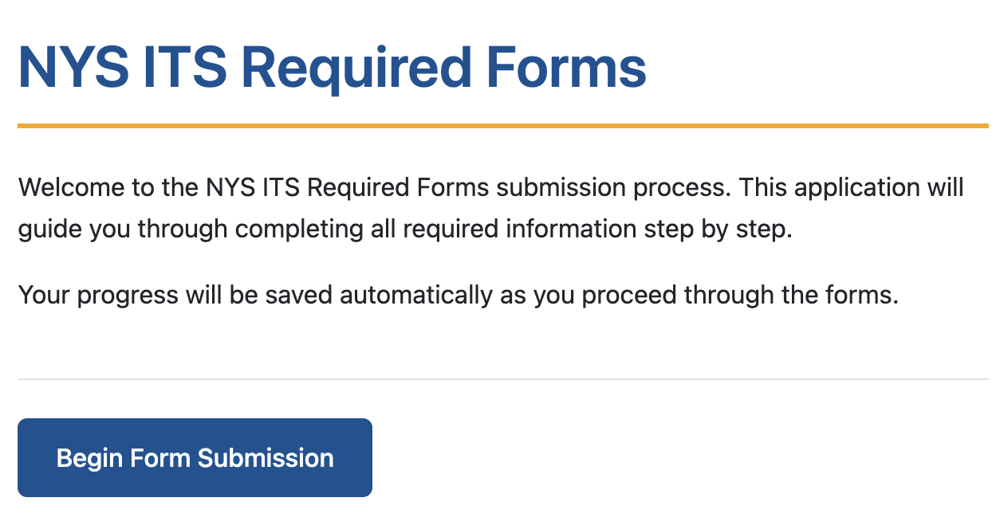

# NYS ITS Required Forms Application

This is a **prototype** multi-page web application for collecting and generating the required procurement forms for New York State Information Technology Services (NYS ITS).

> **Note:**  
> This application is a prototype and is **not an official application of New York State ITS**. It is intended for demonstration and development purposes only.



## Features
- Step-by-step collection of [all required company, personnel, and certification information](unique-data-elements.md)
- Real-time form validation and user-friendly error messages
- Data is saved in the browser (localStorage) so progress is not lost
- Conditional fields and sections based on user input
- Print-ready, formatted summary of all entered information
- Modern, accessible design matching the ITS.NY.gov aesthetic

## Usage

### Quick Start

1. **Open `index.html` in your web browser** (or use a static file server for best results)
2. Complete each section of the form, using the navigation buttons to proceed
3. Review your information on the summary page
4. Use your browser's print function to print or save the completed forms

### Local Development with `lite-server`

For a smoother local development experience, you can use [`lite-server`](https://github.com/johnpapa/lite-server):

1. Install dependencies (if not already):
    ```sh
    npm install
    ```
2. Start the development server:
    ```sh
    npm start
    ```
3. Open the provided local URL in your browser to use the app.

## Project Structure
- `index.html` — Landing page
- `pages/` — Multi-step form pages and summary
- `js/` — JavaScript for form logic and validation
- `styles.css` — Application styling

## Requirements
- No server or backend required
- Works in all modern browsers

---
Developed for NYS ITS procurement compliance and workflow improvement.  
**This is not an official NY State ITS application.**
